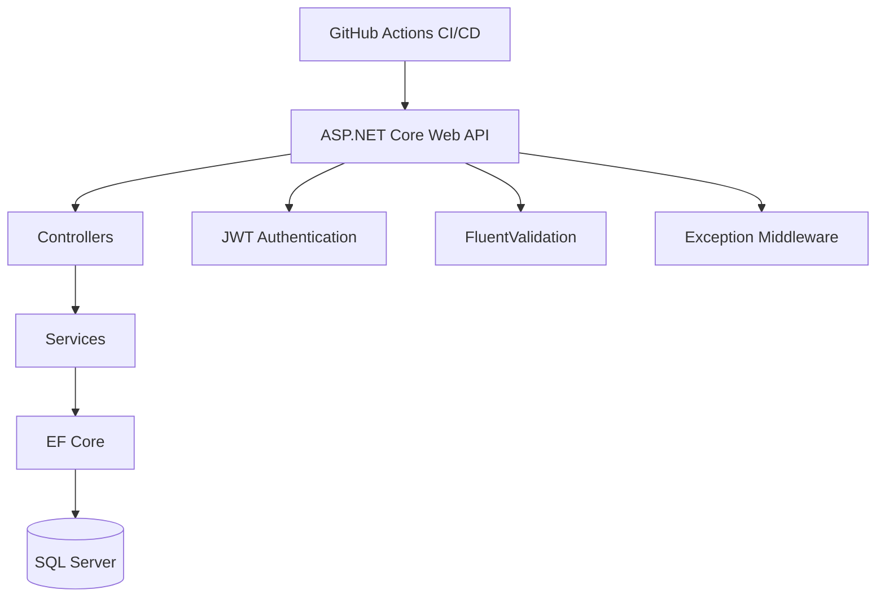
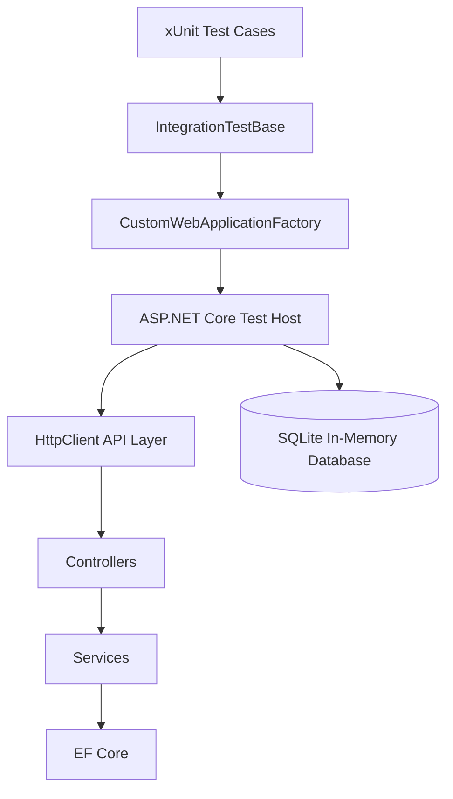

# DeviceManagement.Api Architecture

## Overall Architecture

```mermaid
graph TD

    A[GitHub Actions CI/CD]

    A --> B[ASP.NET Core Web API]

    B --> C[Controllers]

    C --> D[Services]

    D --> E[EF Core]

    E --> F[(SQL Server)]

    B --> G[JWT Authentication]

    B --> H[FluentValidation]

    B --> I[Exception Middleware]
```

---

## Test Automation Architecture

```mermaid
graph TD

    A[xUnit Test Cases]

    A --> B[IntegrationTestBase]

    B --> C[CustomWebApplicationFactory]

    C --> D[ASP.NET Core Test Host]

    D --> E[HttpClient API Layer]

    D --> F[(SQLite In-Memory Database)]

    E --> G[Controllers]

    G --> H[Services]

    H --> I[EF Core]
```

---

## CI/CD Pipeline

```mermaid
graph LR

    A[Feature Branch]

    A --> B[Smoke Test]

    B --> C[Pull Request]

    C --> D[Merge Main]

    D --> E[Regression Test]

    E --> F[Code Coverage]

    F --> G[ReportGenerator]

    G --> H[GitHub Pages]
```